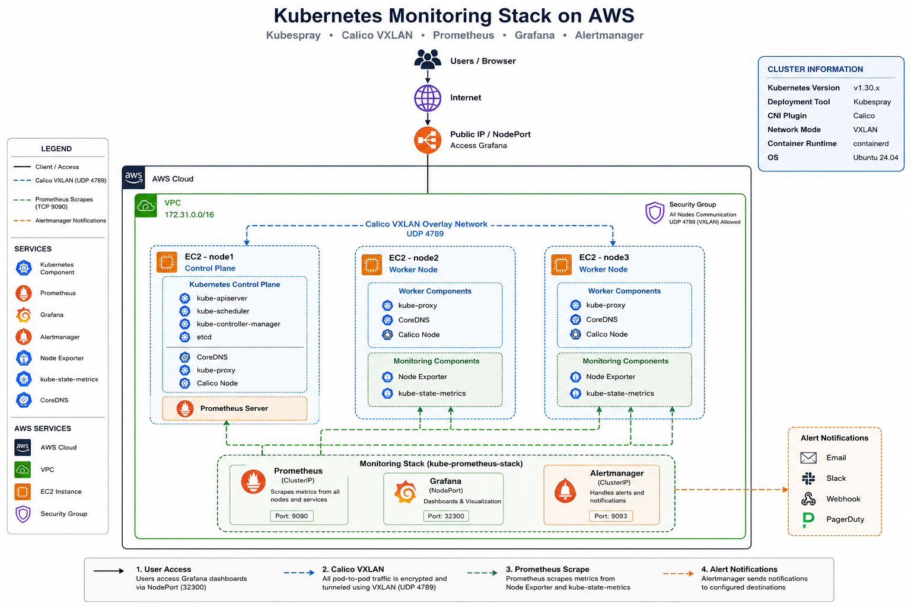
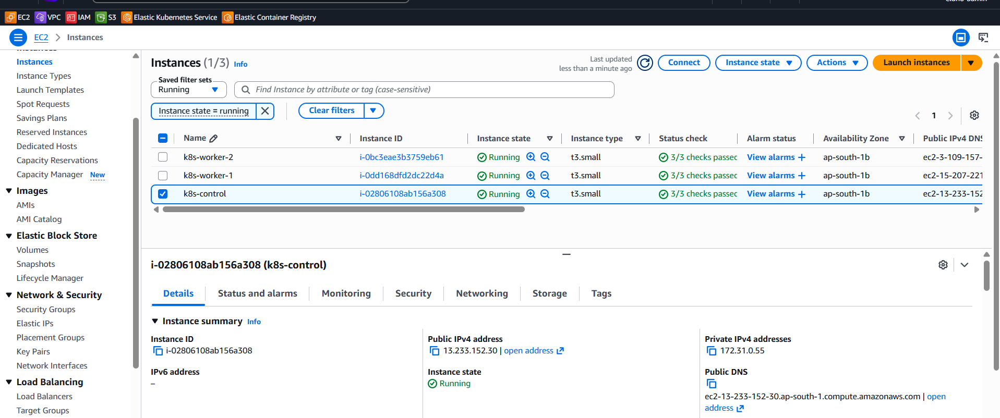
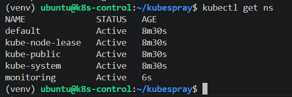

# 🚀 Production-Grade Kubernetes Monitoring Stack on AWS

A production-style Kubernetes monitoring environment deployed on **AWS EC2** using **Kubespray**, featuring **Prometheus**, **Grafana**, **Alertmanager**, and **Node Exporter** for real-time infrastructure monitoring and visualization.

---

## 📌 Project Overview

This project demonstrates how to deploy a highly available Kubernetes cluster on AWS and implement a complete monitoring solution using the **kube-prometheus-stack Helm Chart**.

The monitoring stack continuously collects infrastructure and Kubernetes metrics, stores them in Prometheus, visualizes them through Grafana dashboards, and supports alerting using Alertmanager.

The deployment was performed on AWS EC2 instances using **Kubespray** with **Calico CNI** and includes troubleshooting of real networking issues encountered during deployment.

---
# 🏗 Architecture

The following diagram represents the complete AWS Kubernetes Monitoring Architecture:

---

# 📷 Project Screenshots

## AWS Infrastructure

| EC2 Instances | Security Groups |
|--------------|-----------------|
|  |  |

---

## Kubernetes Cluster

| Nodes | System Pods |
|-------|-------------|
|  |  |

---

## Monitoring Stack

| Monitoring Namespace | Monitoring Pods |
|---------------------|-----------------|
|  |  |

---

## Grafana Dashboards

| Dashboard | CPU & Memory |
|-----------|--------------|
|  |  |

---

# ✨ Features

- Kubernetes Cluster deployed using Kubespray
- AWS EC2 based infrastructure
- Calico CNI networking
- Prometheus Metrics Collection
- Grafana Dashboards
- Alertmanager Integration
- Node Exporter Metrics
- kube-state-metrics
- NodePort access configuration
- DNS troubleshooting
- VXLAN networking troubleshooting
- Production-style monitoring setup

---

# 🛠 Tech Stack

- AWS EC2
- Ubuntu 24.04
- Kubernetes v1.30
- Kubespray
- Ansible
- Calico CNI
- Helm
- Prometheus
- Grafana
- Alertmanager
- Node Exporter
- kube-state-metrics

---

# 📊 Components

| Component | Purpose |
|-----------|---------|
| Kubernetes | Container orchestration |
| Kubespray | Cluster deployment |
| Calico | Pod networking |
| Prometheus | Metrics collection |
| Grafana | Monitoring dashboards |
| Alertmanager | Alert management |
| Node Exporter | Host metrics |
| kube-state-metrics | Kubernetes object metrics |

---
# 🚀 Deployment Flow

1. Created AWS EC2 infrastructure
2. Configured Ubuntu nodes
3. Installed Kubernetes using Kubespray
4. Configured Calico CNI networking
5. Installed kube-prometheus-stack using Helm
6. Configured Grafana dashboards
7. Verified Prometheus targets
8. Tested monitoring components
   
# 📈 Monitoring Workflow

EC2 Nodes

↓

Node Exporter

↓

Prometheus

↓

Grafana Dashboards

↓

Alertmanager

---

# 🔧 Useful Commands

## Check Kubernetes Nodes

kubectl get nodes

## Check Monitoring Pods

kubectl get pods -n monitoring

## Check Prometheus Targets

kubectl get servicemonitors -A

## Check Cluster Resources

kubectl top nodes
kubectl top pods

# 📊 PromQL Queries

## CPU Usage

100 - (avg by(instance)
(rate(node_cpu_seconds_total{mode="idle"}[5m])) * 100)

## Memory Usage

(node_memory_MemTotal_bytes -
node_memory_MemAvailable_bytes)
/ node_memory_MemTotal_bytes * 100

## Pod Restart Count

increase(kube_pod_container_status_restarts_total[1h])

# 🚨 Alert Example

High CPU Alert:

Condition:
CPU usage > 85% for 5 minutes

Action:
Alertmanager sends notification to configured channel.

# 🐞 Troubleshooting

During deployment several production-like issues were identified and resolved.

- Pod-to-Pod communication failure
- Node3 DNS resolution issue
- VXLAN networking issue
- Calico routing verification
- kube-proxy verification
- CoreDNS debugging
- Prometheus connectivity validation
- Grafana datasource troubleshooting

These issues were diagnosed using Kubernetes, Linux networking, Calico, kube-proxy, and Prometheus debugging techniques until the monitoring stack became fully operational.

---
# 📚 Lessons Learned

- Kubernetes networking requires proper CNI configuration
- Monitoring is critical for production environments
- Prometheus exporters provide visibility into infrastructure
- Grafana dashboards simplify troubleshooting
- Alerting helps detect failures proactively
  
# 🚀 Skills Demonstrated

- Kubernetes Administration
- AWS Infrastructure
- Linux Administration
- Ansible Automation
- Kubespray Deployment
- Helm Package Management
- Prometheus Monitoring
- Grafana Dashboarding
- Cluster Networking
- Calico VXLAN
- DNS Troubleshooting
- Service Discovery
- Production Monitoring
---

# 📷 Final Result

✔ Kubernetes Cluster Running

✔ Monitoring Stack Healthy

✔ Prometheus Connected

✔ Grafana Connected

✔ Node Exporter Collecting Metrics

✔ Dashboards Working

✔ Production Monitoring Environment Ready

---

## ⭐ If you found this project useful, consider giving it a Star!
